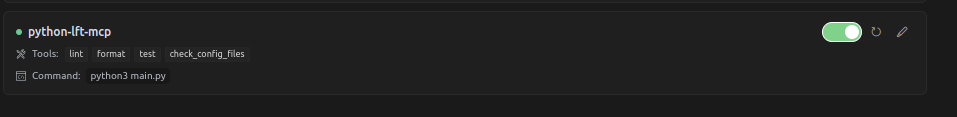
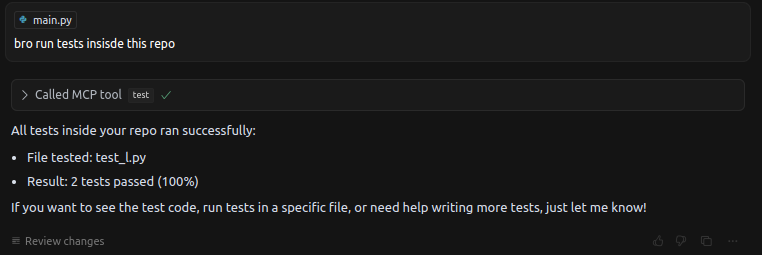

python-lft-mcp

A simple MCP server for lint, format, and test operations using Ruff, Black, and pytest. This project explores the Model Context Protocol (MCP) and demonstrates how to integrate developer tools into an LLM-powered IDE or inspector.

Note: This is an experimental proof-of-concept. Developers should continue to run Ruff, Black, and pytest manually or via existing CI workflows until this project is mature enough to:

    Analyze the codebase for configured developer tools and settings.
    
    Automatically determine the optimal param to invoke tool-calls via an LLM interface.

MCP Inspector View

Tool Call

